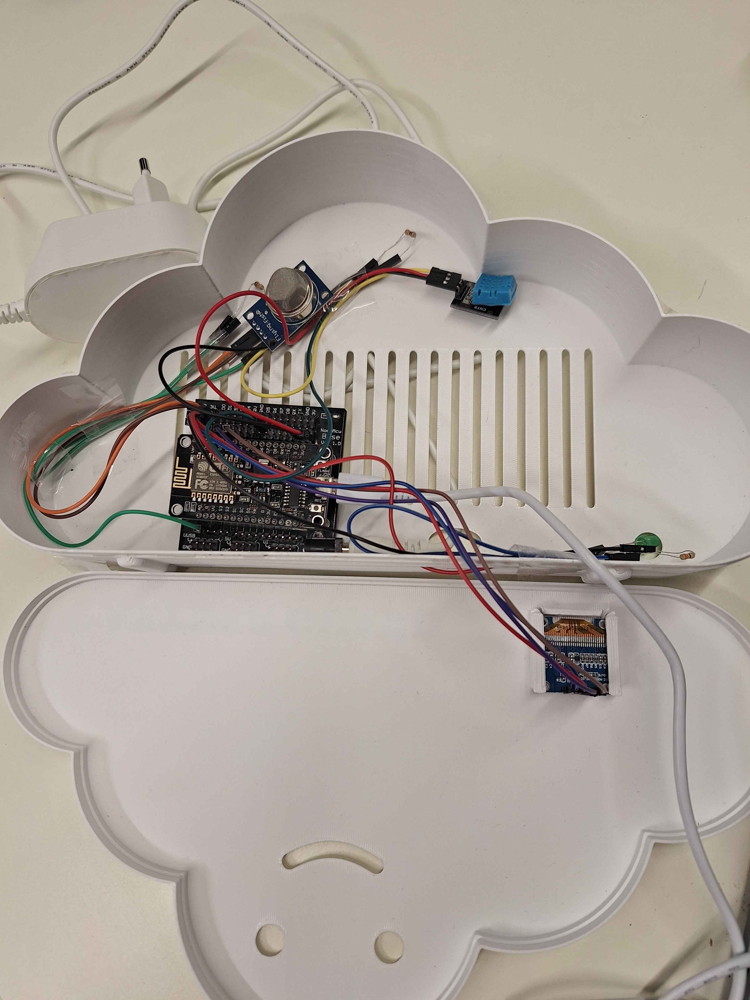
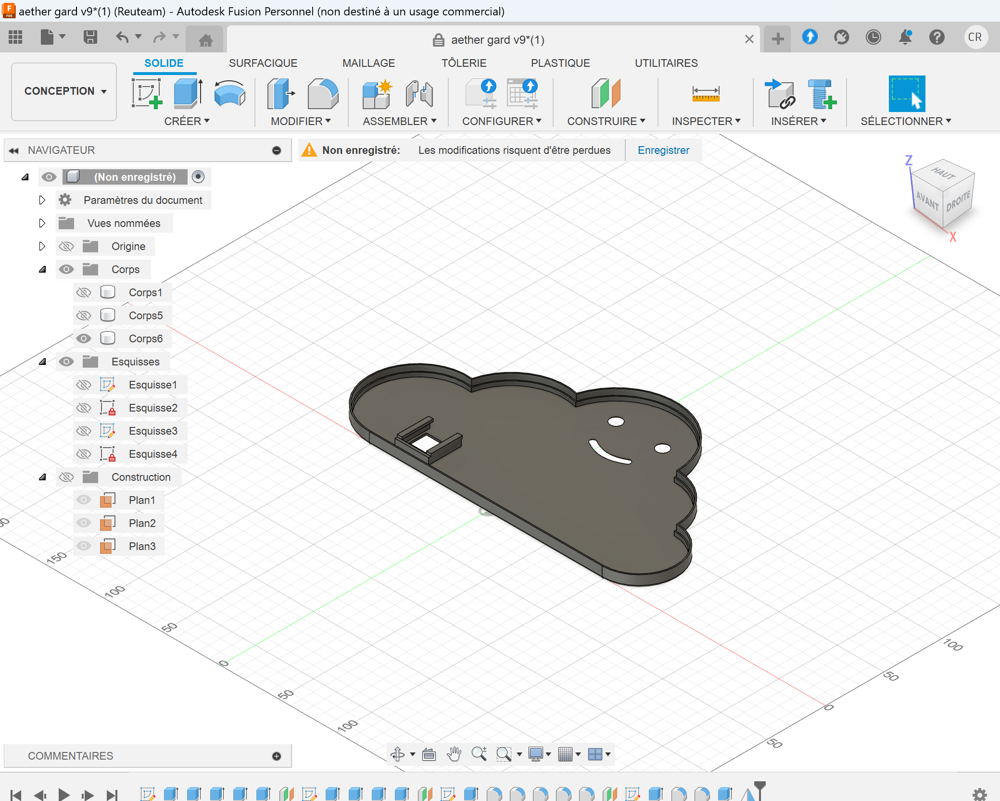
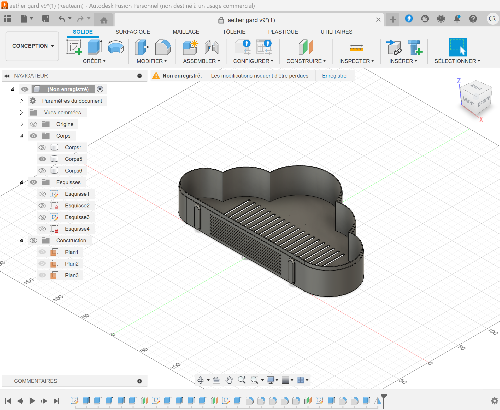

# AetherGuard

AetherGuard is an Arduino project designed to monitor air quality, temperature, and humidity using various sensors. The project uses a DHT11 sensor for temperature and humidity measurements, an MQ-135 sensor for air quality measurement, and an OLED display to show real-time data. The data is also published to an MQTT server for remote monitoring.

### File Descriptions

- **AetherGuard.ino**: The main file that initializes the sensors, connects to WiFi and the MQTT server, and manages the main loop.
- **config.h**: Contains configurations for WiFi, MQTT, NTP, and sensors.
- **displayScreen.h**: Manages the initialization and display of data on the OLED screen.
- **MQ135.cpp** and **MQ135.h**: Library for the MQ-135 sensor, modified to allow automatic calibration.
- **sensors.h**: Manages the initialization of sensors and reading data.
- **time_utils.h**: Manages time synchronization via NTP.
- **utils.h**: Contains utility functions, such as creating JSON payloads.
- **wifi_mqtt.h**: Manages WiFi and MQTT server connections and data publishing.

## Installation

1. Clone this repository to your local machine.
2. Open the project in the Arduino IDE.
3. Install the necessary libraries:
   - DHT sensor library
   - Adafruit GFX Library
   - Adafruit SSD1306
   - PubSubClient
   - NTPClient
4. Upload the code to your Arduino board.
5. Have fun ;)

## Usage

1. Connect the sensors and the OLED display to the appropriate pins on your Arduino board.
2. Configure your WiFi network and MQTT settings in the `config.h` file.
3. Upload the code to your Arduino board.
4. Open the serial monitor to see real-time data. (you can see the data on the display or with the fitness room mobile app if you have installed it)

## Images

## License

This project is licensed under the [GNU General Public License v3.0](LICENSE).

## Acknowledgements

Part of the code related to the MQ135 sensor comes from [GeorgK/MQ135](https://github.com/GeorgK/MQ135/tree/master) which is a **GNU General Public License v3.0** library. This library allows me to recover data from the MQ135, I had to make a small modification to calibrate the auto sensor (I just passed a private variable to public).

Thanks to Manuel Reuther who helped me with 3d modeling and printing. (Autodesk Fusion 360 is used to modelise the cloud)

## PS

The resistors used for the sensors range from 10k to 2.2k for 3.3 V. Don't hesitate to test with large resistors first to avoid damaging the sensors.